# 企业
## 企业录入
### 企业录入时序图 
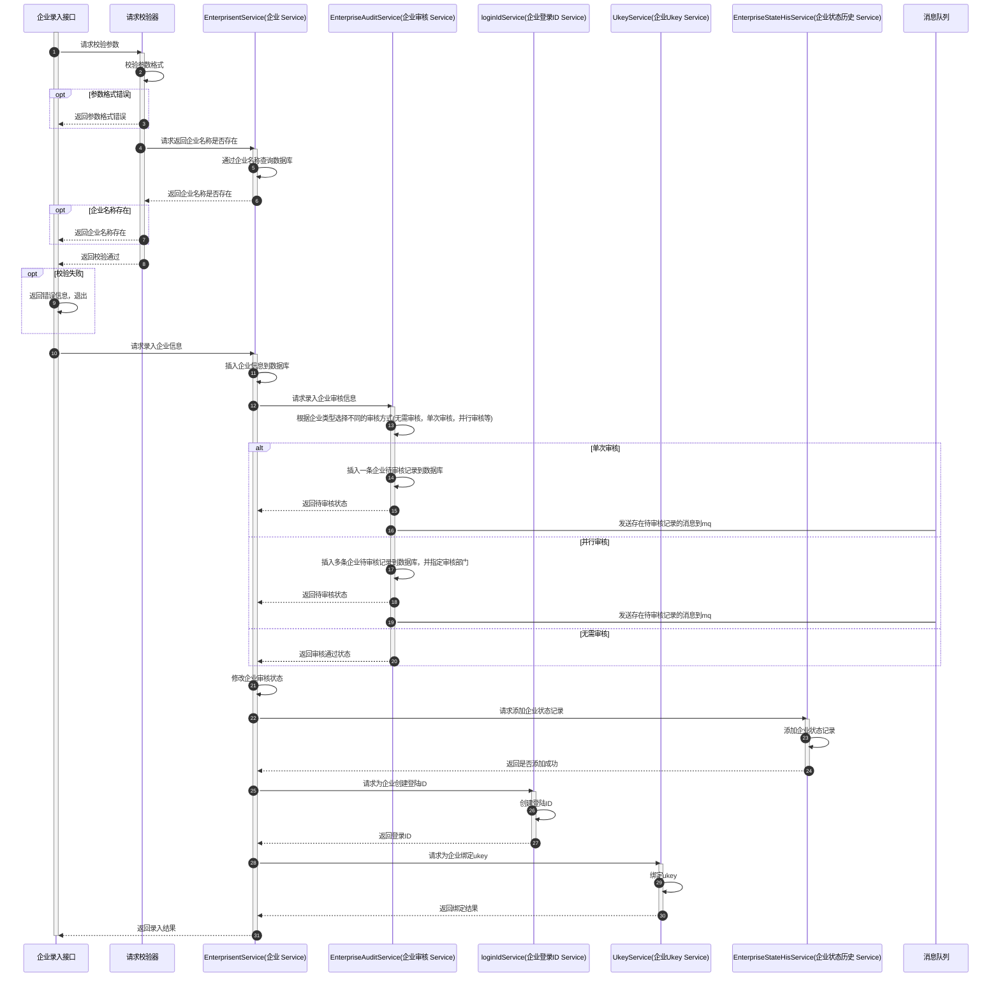
### 企业录入审核通过时序图
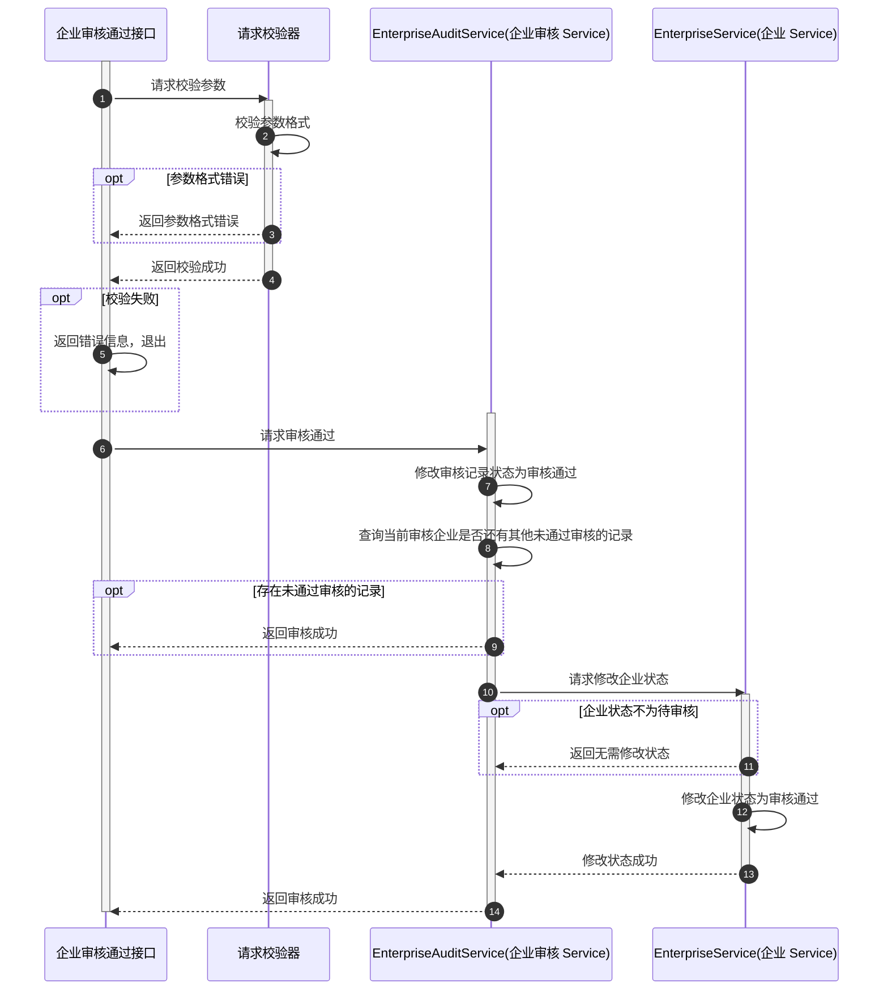

### 企业录入审核驳回时序图

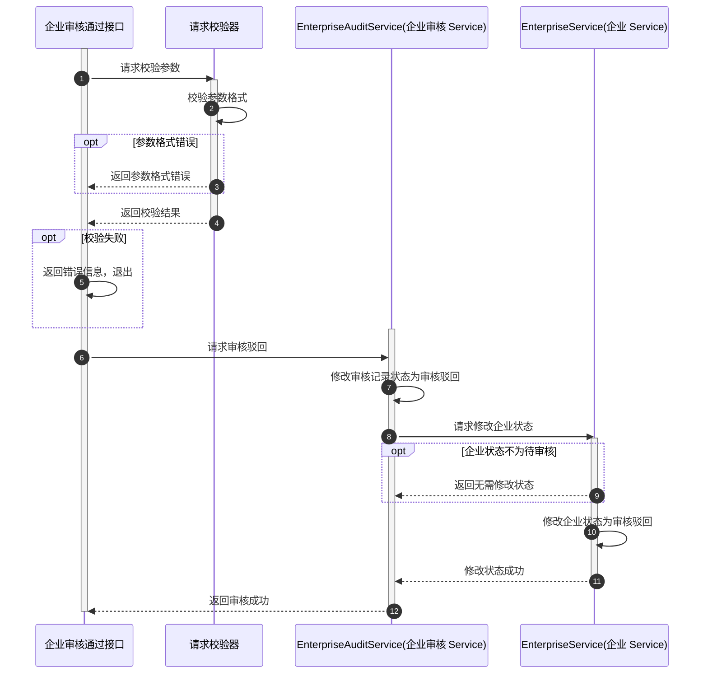

### 企业录入-上传承诺书时序图

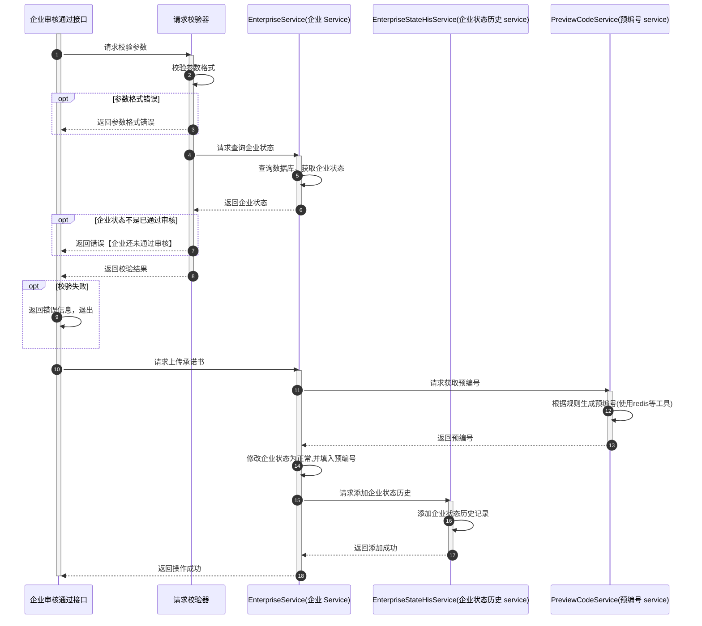

### 企业驳回后-重新录入时序图

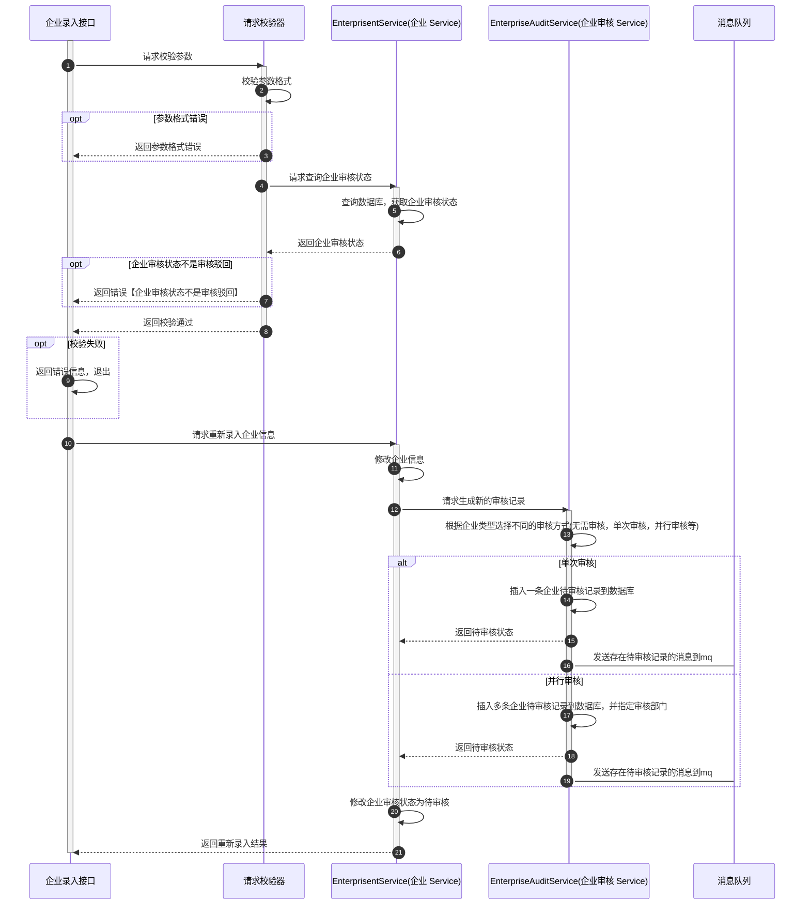

## 企业清退

### 企业清退时序图
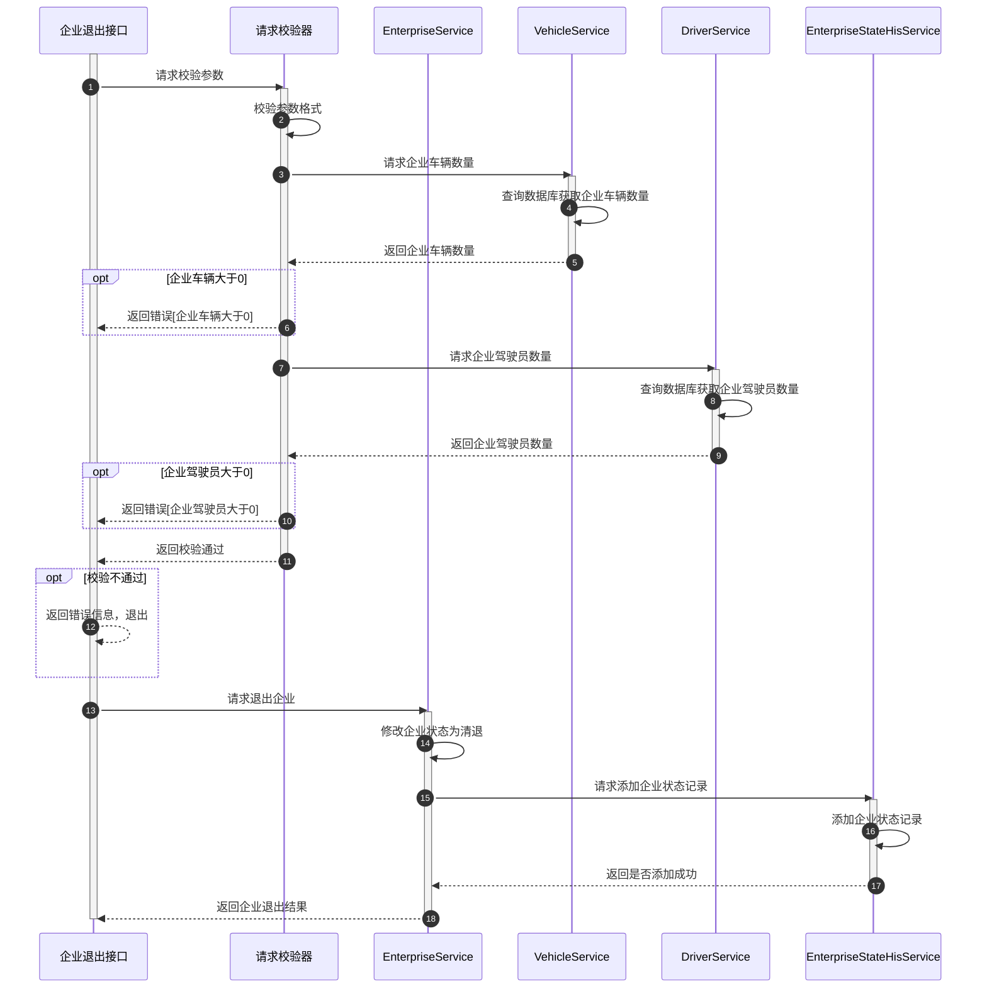

## 企业审核状态-状态图

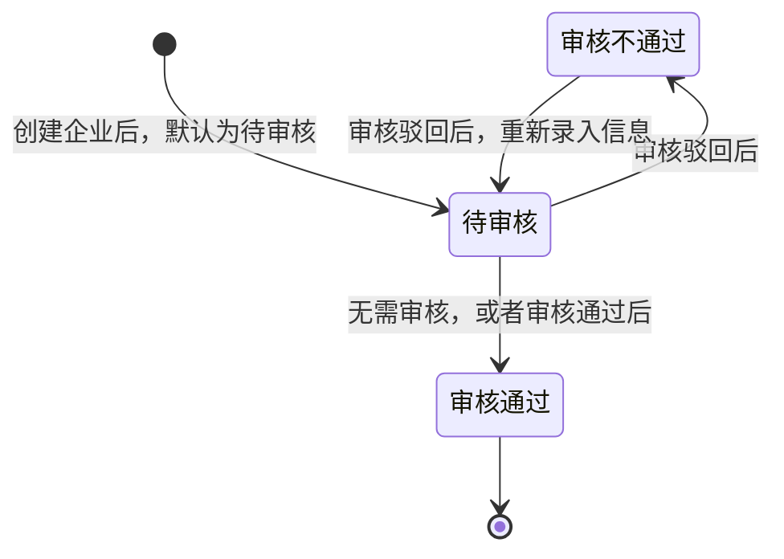

## 企业状态-状态图

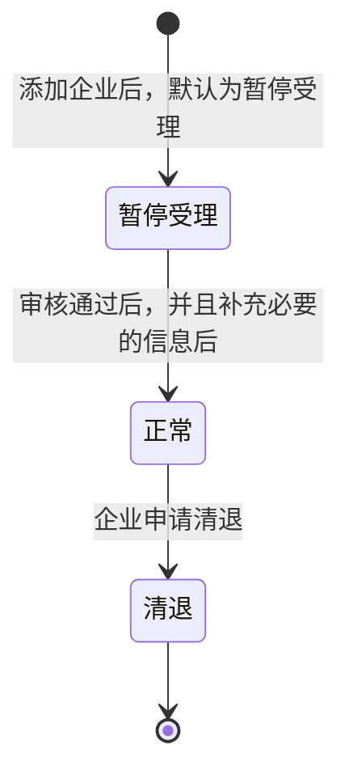

# 工程项目

## 工程项目报备

### 工程项目报备录入时序图

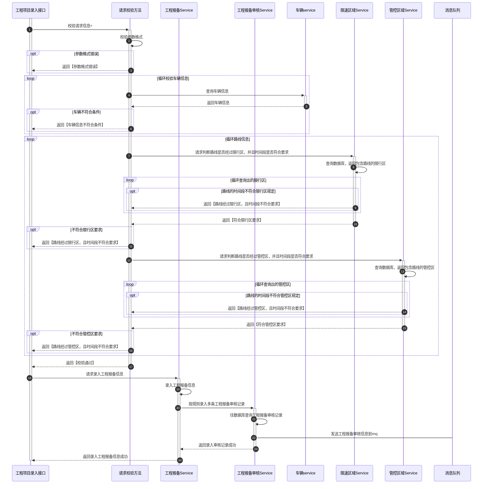

### 工程项目报备审核通过时序图

整体流程跟企业审核通过一样

### 工程项目报备审核驳回时序图

整体流程跟企业审核驳回一样

# 路线

## 路线报备
### 路线报备时序图

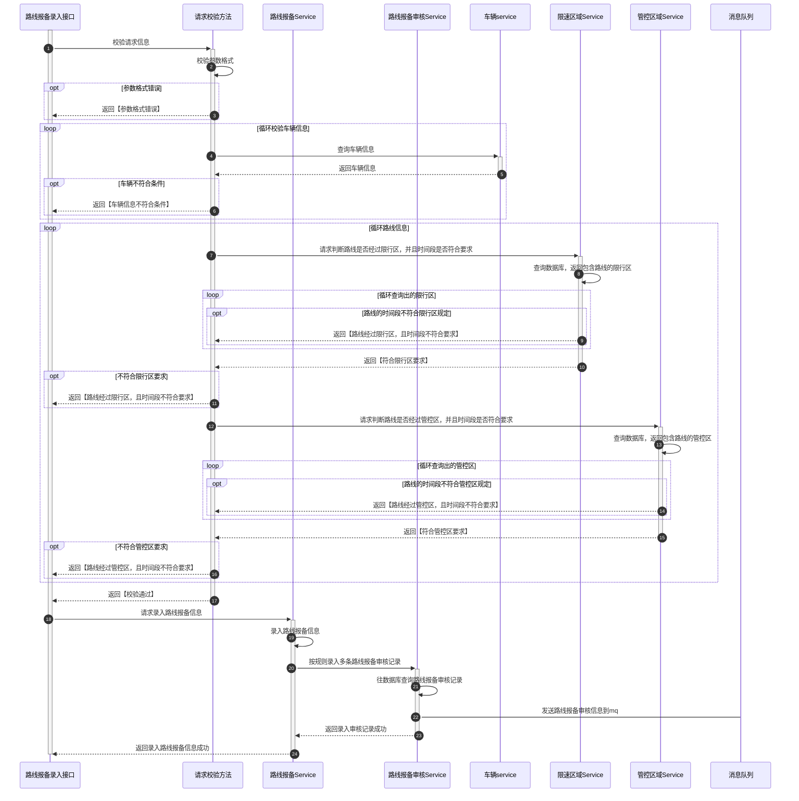

### 路线报备审核通过时序图

整体流程跟企业审核通过一样

### 路线报备审核驳回时序图

整体流程跟企业审核驳回一样

# 线路牌

## 线路牌发放

### 线路牌发放时序图

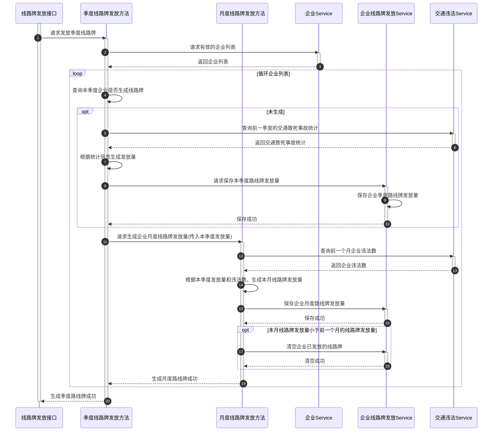

# 电子围栏

## 电子围栏报警

### 电子围栏报警时序图

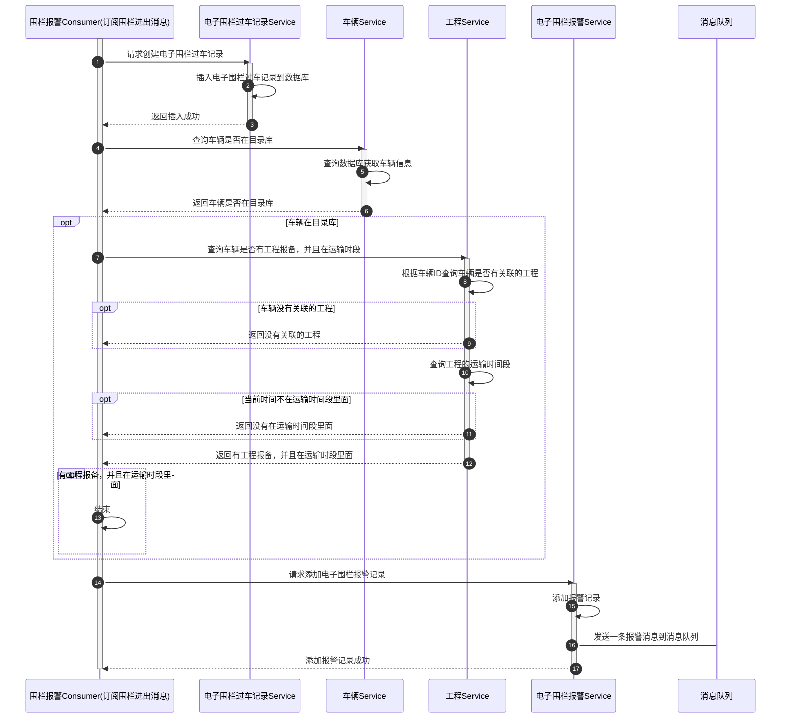

